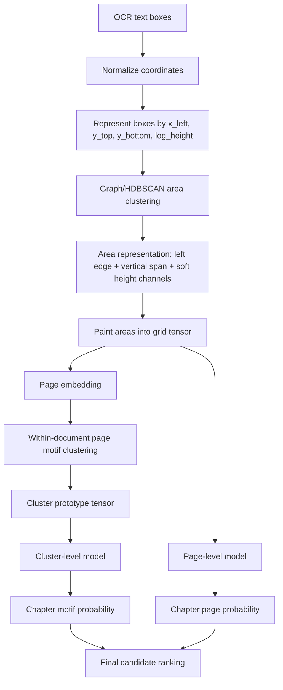

맞아. 다시 정리하면 목표는 이겁니다.

> **챕터 시작 페이지를 사람이 rule로 정의하지 않는다.**
> OCR text box들의 공간 구조를 grid representation으로 바꾸고, **반복되는 page layout cluster 중 어떤 cluster가 실제 bookmark destination인지**를 bookmark가 있는 PDF들로부터 학습한다.

즉, 알고리즘의 중심은 heuristic detector가 아니라:

```text id="lv2ap5"
OCR boxes
→ area clustering
→ grid layout tensor
→ page layout clustering
→ cluster-level classifier / scorer
→ chapter page candidates
```

입니다.

---

## 1. 핵심 문제 정의를 바꾸자

이 문제를 “큰 글씨가 있으면 챕터”라고 정의하면 안 됩니다.

그 대신 이렇게 정의하는 게 좋습니다.

```text id="xw8qtm"
한 PDF 안에는 여러 page layout motif가 있다.

- 일반 본문 motif
- 챕터 시작 motif
- 목차 motif
- 표/그림 motif
- 연습문제 motif
- 참고문헌 motif
...

우리는 bookmark가 있는 PDF들을 이용해,
그중 어떤 motif가 실제 chapter bookmark destination이었는지를 학습한다.
```

즉, 챕터 페이지 탐지는 rule-based page classification이 아니라:

```text id="usocd0"
repeated layout motif mining + supervised motif identification
```

에 가깝습니다.

---

## 2. font size는 rule이 아니라 representation에 넣어야 함

`height >= 1.8 * body_height` 같은 threshold는 좋지 않습니다.

대신 text box height를 **continuous signal**로 grid에 넣습니다.

예를 들어 각 box 또는 area를 다음처럼 표현합니다.

```python id="mc274a"
box = {
    "x_left": x0,
    "y_top": y0,
    "y_bottom": y1,
    "log_height": log(y1 - y0),
}
```

여기서 중요한 점은:

```text id="0ivrcp"
x_right, width는 핵심 feature로 쓰지 않는다.
```

제목의 길이는 챕터마다 달라질 수 있기 때문입니다.

```text id="ir9acx"
Chapter 1
Chapter 2. Long Title
Chapter 3. Very Long Title
```

이 셋은 `x_left`, `y_top`, `height`는 비슷하지만 `width`는 다릅니다.

따라서 text box를 rectangle 전체가 아니라 거의 다음처럼 봅니다.

```text id="ncviz8"
left vertical segment + height
```

즉:

```text id="wngt5s"
(x_left, y_top, y_bottom, log_height)
```

이 표현이 제목 길이 변화에 훨씬 robust합니다.

---

## 3. text box → area clustering

여기서 area clustering도 “본문 문단”, “제목” 같은 의미를 부여하지 않습니다.

목표는 단순합니다.

```text id="g3s0j5"
공간적으로 가까우며 height scale이 비슷한 text box들을 하나의 area로 압축한다.
```

즉, word box들을 바로 page vector로 쓰지 않고:

```text id="so2ojf"
text boxes → local area clusters → grid
```

로 갑니다.

---

## 4. area clustering은 graph clustering으로 구현하는 게 좋음

각 text box를 node로 봅니다.

```text id="2xh2cm"
node = text box
edge weight = 두 text box가 같은 area에 속할 가능성
```

box $i, j$ 사이의 distance는 대략 다음 feature로 계산합니다.

```text id="267oj0"
- x_left 차이
- y 위치 차이 / vertical gap
- y span overlap
- log_height 차이
```

중요한 것은 이걸 hard threshold로 자르지 않는 것입니다.

예를 들어:

```python id="1iv3y7"
z_i = [
    x_left_i,
    y_top_i,
    y_bottom_i,
    log_height_i,
]
```

그리고 거리:

$$
d(i,j) = (z_i - z_j)^T M (z_i - z_j)
$$

여기서 $M$은 사람이 고정한 rule이 아니라 **튜닝/학습 가능한 metric weight**로 둡니다.

초기에는 diagonal metric이면 충분합니다.

```python id="obawft"
M = diag([
    w_x,
    w_y_top,
    w_y_bottom,
    w_height,
])
```

핵심은 `w_height`가 존재한다는 것입니다.

즉, 같은 위치 근처라도 height가 크게 다르면 다른 area로 분리될 수 있습니다.

하지만 `height > threshold` 같은 rule은 없습니다.

---

## 5. hard-coded eps 대신 HDBSCAN 또는 graph community detection

DBSCAN의 `eps=0.03` 같은 값도 사실상 heuristic입니다. 그래서 가능하면 `eps`를 직접 정하지 않는 방식이 좋습니다.

추천은 둘 중 하나입니다.

### 방식 A. HDBSCAN

HDBSCAN은 fixed radius를 요구하지 않습니다.

```python id="y8rfht"
import hdbscan

clusterer = hdbscan.HDBSCAN(
    min_cluster_size=2,
    min_samples=1,
    metric="euclidean"
)

area_labels = clusterer.fit_predict(box_vectors)
```

`min_cluster_size` 같은 hyperparameter는 남지만, `x 차이가 몇 이하면 같은 area` 같은 rule보다 훨씬 낫습니다.

---

### 방식 B. mutual kNN graph + community detection

더 좋은 구조는 이것입니다.

```text id="w845rd"
1. text box를 feature space에 놓는다.
2. 각 box의 k-nearest neighbors를 찾는다.
3. mutual kNN인 경우만 edge를 만든다.
4. edge weight는 distance 기반으로 부드럽게 계산한다.
5. Leiden / Louvain / spectral clustering으로 area를 만든다.
```

이 방식은 local density에 적응합니다.

```python id="601trr"
edge_weight_ij = exp(-distance_ij / local_scale_i)
```

여기서 `local_scale_i`는 해당 box 주변 kNN distance로 잡습니다.

즉, 문서마다 글자 크기나 OCR 밀도가 달라도 자동으로 scale이 맞춰집니다.

---

## 6. area representation

area가 만들어지면 각 area를 다음처럼 요약합니다.

```python id="hug5m2"
area = {
    "x_left": median(x_left of boxes),
    "y_top": min(y_top of boxes),
    "y_bottom": max(y_bottom of boxes),
    "log_height": median(log_height of boxes),
    "mass": number_of_boxes,
}
```

여기서도 width는 핵심에서 제외합니다.

필요하다면 `x_right`는 보조적으로만 쓸 수 있습니다.

```python id="0iw37a"
optional = {
    "x_right_p90": percentile(x_right, 90)
}
```

하지만 page motif matching의 중심은 아닙니다.

---

## 7. area → grid layout tensor

이제 각 page를 grid tensor로 바꿉니다.

예를 들어 $G_y \times G_x = 32 \times 24$ grid를 둡니다.

각 area를 rectangle 전체로 칠하지 말고, **left-edge vertical segment**로 칠합니다.

```python id="qtom61"
x_cell = grid_x(area.x_left)
y0_cell = grid_y(area.y_top)
y1_cell = grid_y(area.y_bottom)

for y in range(y0_cell, y1_cell + 1):
    grid[y, x_cell, channel] += value
```

추천 channel은 최소한으로 갑니다.

```text id="ksk420"
channel 1: area presence / count
channel 2: log_height
channel 3: mass
```

더 좋은 방식은 height를 하나의 숫자로 넣는 대신, height distribution을 soft channel로 넣는 것입니다.

---

## 8. font size를 soft typographic channel로 넣기

문서마다 font size scale이 다릅니다.

따라서 raw height를 그대로 쓰면 PDF 간 비교가 어렵습니다.

대신 각 문서에서 text box height 분포를 보고, log-height를 정규화합니다.

```python id="pbaeny"
z_height = (log_height - median_log_height) / iqr_log_height
```

또는 GMM을 fit합니다.

```python id="4c7m9y"
height_components = GMM(K=4).fit(log_heights)
```

그러면 각 area는 다음과 같은 soft vector를 가집니다.

```python id="7sy8yl"
height_posterior = [
    p(small_font),
    p(body_font),
    p(subtitle_font),
    p_large_font)
]
```

여기서도 `large_font`를 사람이 threshold로 정하지 않습니다.

문서 내부 height 분포의 mixture component로부터 나옵니다.

grid channel은 이렇게 됩니다.

```text id="s5sria"
channel 1: area presence
channel 2: height_component_1 probability
channel 3: height_component_2 probability
channel 4: height_component_3 probability
channel 5: height_component_4 probability
channel 6: mass
```

이렇게 하면 모델은 자연스럽게 배울 수 있습니다.

```text id="wjsgsv"
챕터 페이지 cluster에는 특정 위치에 high-height component가 자주 나타난다.
```

하지만 우리는 `high-height component가 있으면 챕터`라고 rule을 만들지 않습니다.

---

## 9. page vector clustering

각 page는 grid tensor입니다.

```python id="r5m3lo"
page_tensor.shape = (Gy, Gx, C)
page_vector = page_tensor.flatten()
```

그다음 page layout embedding을 만듭니다.

초기에는 PCA가 충분합니다.

```python id="rzn5oo"
from sklearn.decomposition import PCA

page_embeddings = PCA(n_components=32).fit_transform(page_vectors)
```

조금 더 나아가면 autoencoder나 contrastive encoder를 쓸 수 있습니다.

```text id="kbd37r"
grid tensor → encoder → page embedding
```

그다음 같은 PDF 안에서 page layout cluster를 찾습니다.

```python id="f4rqtm"
page_clusters = HDBSCAN(
    min_cluster_size=2,
    min_samples=1
).fit_predict(page_embeddings)
```

여기서 얻는 것은 “챕터 cluster”가 아니라 그냥 반복 layout motif입니다.

```text id="a70mj9"
cluster 0: 일반 본문 motif
cluster 1: 챕터 시작 motif일 수도 있음
cluster 2: 목차 motif일 수도 있음
cluster 3: 문제 풀이 페이지일 수도 있음
...
```

---

## 10. 중요한 부분: 어떤 cluster가 챕터 cluster인지 학습한다

여기가 핵심입니다.

bookmark가 있는 PDF가 있다면, 각 PDF에서 ground truth chapter pages를 만들 수 있습니다.

```python id="49l9mf"
gt_chapter_pages = pages_from_level_1_bookmarks(pdf)
```

그다음 page cluster마다 label을 붙일 수 있습니다.

```python id="k9hwqk"
cluster_pages = {12, 38, 71, 105}

cluster_label = 1 if cluster_pages overlap strongly with gt_chapter_pages else 0
```

하지만 이것도 threshold가 들어갈 수 있으므로 더 부드럽게 label을 줄 수 있습니다.

```python id="47xg8p"
cluster_target = len(cluster_pages & gt_chapter_pages) / len(cluster_pages)
```

즉, binary label이 아니라:

```text id="vpqk38"
이 cluster가 chapter cluster일 확률/순도
```

를 regression target으로 둡니다.

예:

```text id="qx7ax1"
cluster A: target = 0.95
cluster B: target = 0.02
cluster C: target = 0.40
```

이렇게 하면 애매한 cluster도 처리할 수 있습니다.

---

## 11. cluster-level classifier

각 cluster를 하나의 sample로 봅니다.

cluster representation은 다음 중 하나로 만들 수 있습니다.

### 간단한 방식

cluster에 속한 page tensor들의 median을 씁니다.

```python id="xexq7j"
cluster_prototype = median(page_tensors_in_cluster, axis=0)
```

그다음 classifier를 학습합니다.

```python id="c9vpgv"
model.fit(cluster_prototype, cluster_target)
```

모델은 처음에는 단순한 것이 좋습니다.

```text id="xxqe60"
- Logistic regression
- Linear SVM
- Random forest
- LightGBM
- Small CNN
```

데이터가 많지 않으면:

```text id="fpkb8h"
PCA + logistic regression
```

이 가장 안정적입니다.

---

### 더 좋은 방식

cluster 안의 여러 page tensor를 set으로 보고, DeepSets 구조를 씁니다.

```text id="tlhzpr"
cluster = {page_tensor_1, page_tensor_2, ..., page_tensor_n}
```

모델:

```text id="mt7hop"
page tensor → page encoder → embeddings
embeddings → pooling(mean/max/attention) → cluster embedding
cluster embedding → chapter cluster probability
```

이 방식은 cluster size가 달라도 처리할 수 있습니다.

---

## 12. page-level classifier와 cluster-level classifier를 같이 쓰는 구조

가장 좋은 구조는 두 점수를 같이 쓰는 것입니다.

### Page-level score

각 page가 chapter destination일 확률:

```python id="91ij39"
p_page = model_page(page_tensor)
```

### Cluster-level score

해당 page가 속한 layout cluster가 chapter motif일 확률:

```python id="yk93r0"
p_cluster = model_cluster(cluster_prototype)
```

최종 score:

```python id="ffhd3k"
score_page = combine(p_page, p_cluster)
```

여기서도 combine은 rule로 만들기보다 validation set에서 calibrate합니다.

예:

```python id="b2iitd"
score = logistic_regression([
    p_page,
    p_cluster,
])
```

이 구조가 좋은 이유는 다음입니다.

```text id="70xvns"
page-level model:
  큰 제목부가 있는 개별 페이지를 잘 감지함

cluster-level model:
  문서 안에서 반복되는 chapter motif를 잘 감지함
```

즉, 사용자가 말한 두 직관을 모두 반영합니다.

```text id="609zdw"
1. 챕터 시작 페이지 모양은 반복된다.
2. 챕터 시작 페이지에는 font 큰 제목부가 들어간다.
```

하지만 둘 다 hard-coded rule이 아닙니다.

---

## 13. 최종 알고리즘

전체 흐름은 이렇게 가면 됩니다.



핵심은 이겁니다.

```text id="k4jh0o"
feature engineering으로 chapter를 정의하지 않는다.
representation은 풍부하게 만들고,
chapter 여부는 bookmark ground truth로 학습한다.
```

---

## 14. 훈련 데이터 만드는 법

bookmark 있는 PDF에서 다음을 뽑습니다.

```python id="m73uqw"
for pdf in bookmarked_pdfs:
    gt_pages = extract_level1_bookmark_destination_pages(pdf)

    for page in pdf.pages:
        page_tensor = build_page_tensor(page.ocr_boxes)
        y_page = 1 if page.number in gt_pages else 0
```

page-level dataset:

```text id="a9lx7q"
X_page = page grid tensor
y_page = bookmark destination 여부
```

cluster-level dataset:

```text id="0bp7d0"
X_cluster = cluster prototype tensor
y_cluster = cluster purity against bookmark pages
```

여기서 중요한 것은 level을 구분해야 한다는 점입니다.

```text id="5ytatl"
Level 1 bookmark: 챕터
Level 2 bookmark: 섹션
Level 3 bookmark: 하위 섹션
```

처음에는 Level 1만 쓰는 게 좋습니다.

나중에 Level 2까지 하고 싶으면 별도 task로 분리해야 합니다.

---

## 15. 모델 선택

처음부터 deep learning으로 갈 필요는 없습니다.

추천 순서는 이렇습니다.

## MVP

```text id="aiq41v"
- area clustering: HDBSCAN or mutual kNN graph
- page tensor: grid flatten
- embedding: PCA
- page motif clustering: HDBSCAN
- cluster scorer: logistic regression / LightGBM
```

이 정도면 충분히 실험 가능합니다.

---

## 개선 버전

```text id="o9i747"
- page tensor encoder: small CNN
- cluster scorer: DeepSets
- loss: page-level BCE + cluster-level regression loss
```

---

## 더 고급 버전

```text id="oymm3s"
- contrastive learning
- 같은 PDF 안의 동일 motif cluster는 positive pair
- 다른 motif는 negative pair
- bookmark pages는 supervised anchor로 사용
```

이렇게 하면 page embedding 자체가 layout motif를 더 잘 반영하게 됩니다.

---

## 16. hard-coded threshold 대신 validation-tuned decision

완전히 threshold가 없을 수는 없습니다. 최종적으로는 후보를 몇 개 뽑을지 결정해야 합니다.

하지만 중요한 차이는 이것입니다.

나쁜 방식:

```python id="i6tsgl"
if height > 1.8 and y < 0.3:
    chapter = True
```

좋은 방식:

```python id="3uxbuk"
score = model(page_tensor, cluster_prototype)
```

그리고 threshold는 validation set에서 정합니다.

```python id="ihwduw"
best_threshold = argmax_f1(validation_pdfs)
```

즉, threshold가 사람이 만든 rule이 아니라 **검증 데이터로 calibration된 decision boundary**가 됩니다.

더 나아가 threshold 없이 ranking으로 볼 수도 있습니다.

```text id="f6b5qg"
각 PDF에서 chapter probability가 높은 page cluster를 순서대로 제시
```

bookmark 생성 자동화에서는 score cutoff가 필요하지만, 실험 단계에서는 ranking metric이 더 좋습니다.

```text id="jqqnqd"
Recall@K
MRR
Average precision
```

---

## 17. 평가 방식

PDF 단위로 train/test split해야 합니다.

```text id="8vqu6y"
좋은 평가:
  PDF A, B, C로 학습
  PDF D, E로 평가

나쁜 평가:
  같은 PDF의 일부 페이지로 학습하고 일부 페이지로 평가
```

평가 지표는:

```text id="65gn0o"
- page-level precision / recall / F1
- ±1 page tolerance F1
- cluster purity
- cluster coverage
- Recall@K
```

특히 cluster-level에서는 다음이 중요합니다.

```python id="zxzesa"
purity = matched_gt_pages_in_cluster / cluster_size
coverage = matched_gt_pages_in_cluster / total_gt_chapter_pages
```

좋은 cluster는:

```text id="5tbdcd"
purity도 높고 coverage도 높다.
```

---

## 18. 이 설계가 기존 heuristic보다 좋은 이유

이전 방식은 사람이 이런 식으로 판단했습니다.

```text id="85fqny"
큰 글씨가 있으면 챕터
너무 많이 반복되면 본문
간격이 넓으면 챕터
y 위치가 위쪽이면 제목
```

이건 문서가 바뀌면 쉽게 깨집니다.

새 설계는 다릅니다.

```text id="sx9lyz"
- 큰 글씨 여부는 height channel에 들어간다.
- 제목 위치는 grid coordinate에 들어간다.
- 반복 motif 여부는 page clustering에 들어간다.
- 어떤 motif가 챕터인지는 bookmark ground truth로 학습한다.
```

즉, 사람이 rule을 쓰는 것이 아니라 모델이 다음 패턴을 학습합니다.

```text id="00crbm"
“이런 grid pattern을 가진 반복 cluster가 실제 bookmark destination이었다.”
```

---

## 19. 최종 추천 구조

가장 현실적인 첫 구현은 이것입니다.

```python id="6wsjpa"
for pdf in pdfs:
    boxes_by_page = extract_ocr_boxes(pdf)

    page_tensors = []

    for boxes in boxes_by_page:
        boxes = normalize_boxes(boxes)

        box_points = make_box_points(
            boxes,
            features=["x_left", "y_top", "y_bottom", "log_height"]
        )

        areas = cluster_boxes_to_areas(
            box_points,
            method="hdbscan_or_knn_graph"
        )

        page_tensor = paint_areas_to_grid(
            areas,
            grid_size=(32, 24),
            channels=[
                "presence",
                "soft_height_components",
                "mass"
            ],
            mode="left_edge"
        )

        page_tensors.append(page_tensor)

    page_embeddings = encode_page_tensors(page_tensors)

    page_clusters = cluster_page_embeddings(page_embeddings)

    cluster_prototypes = build_cluster_prototypes(
        page_clusters,
        page_tensors
    )

    cluster_scores = chapter_cluster_model.predict_proba(
        cluster_prototypes
    )

    page_scores = chapter_page_model.predict_proba(
        page_tensors
    )

    final_candidates = rank_pages(
        page_scores,
        cluster_scores,
        page_clusters
    )
```

---

## 한 문장으로 정리

가장 좋은 방향은 **OCR text box를 left-edge와 height 중심의 layout signal로 grid화하고, 반복되는 page motif를 찾은 뒤, “어떤 motif가 챕터 시작 페이지인지”를 bookmark ground truth로 학습하는 구조**입니다. font 큰 제목부는 hard-coded threshold가 아니라 grid tensor의 height channel로 들어가고, 챕터 여부는 page-level/cluster-level supervised scorer가 학습해야 합니다.
